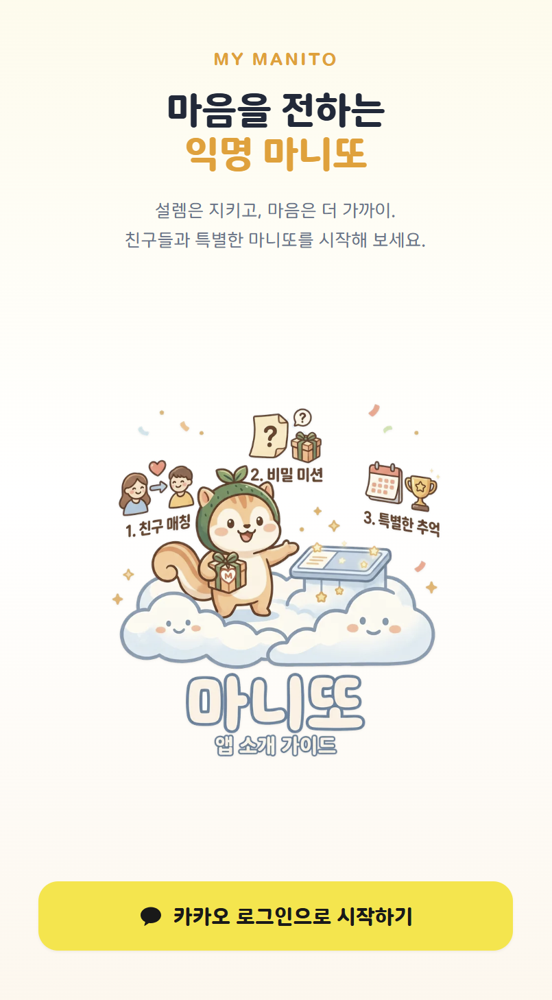
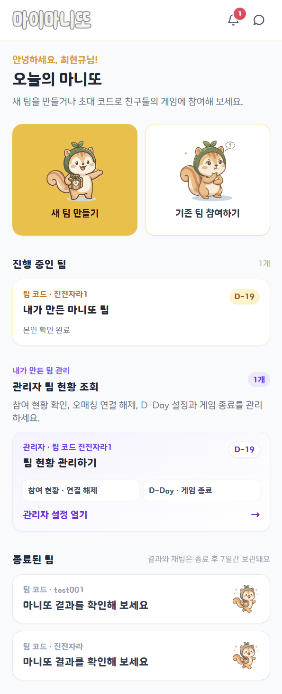
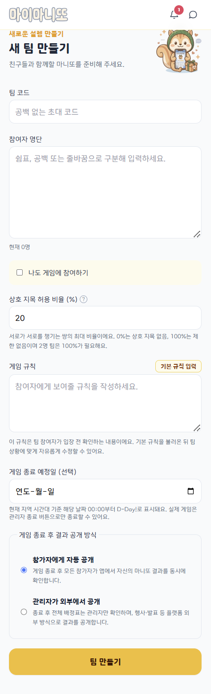
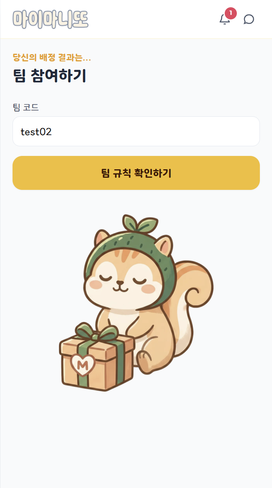
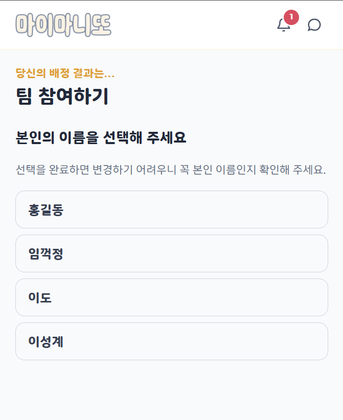
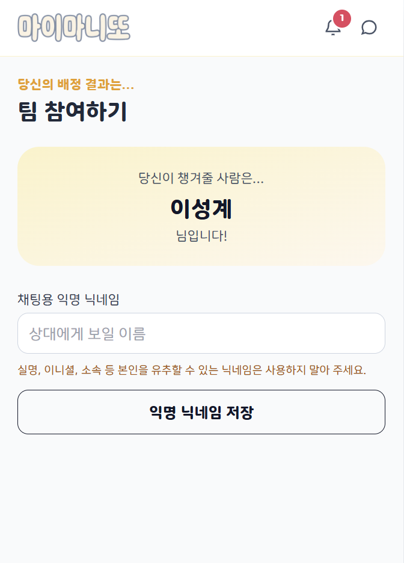
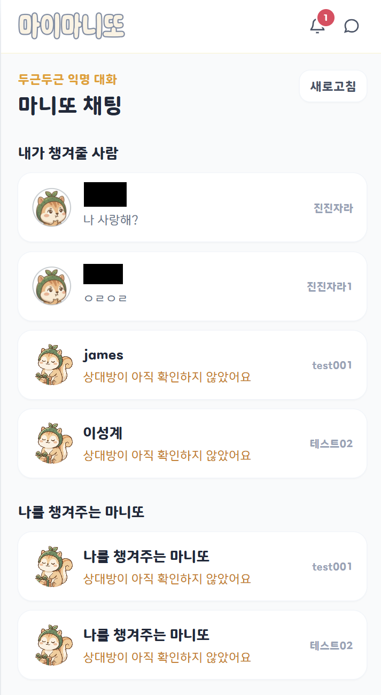
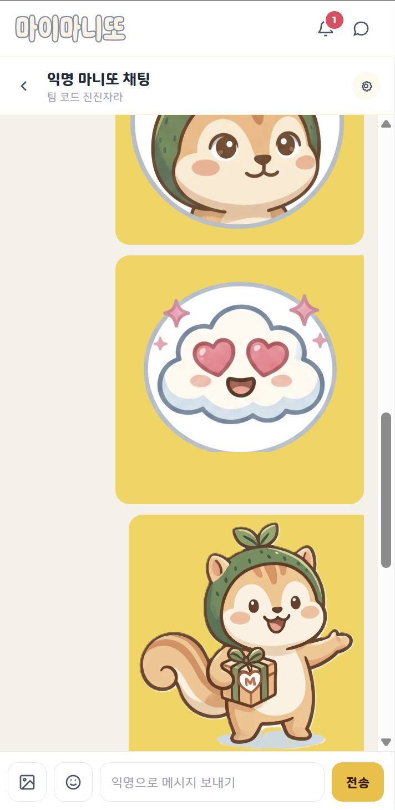

# MyManito (마이마니또)

카카오 로그인으로 쉽고 안전하게 즐기는 **모바일 퍼스트 마니또 게임 플랫폼**입니다. 팀을 만들고, 익명으로 대화하고, 게임이 끝난 뒤 설레는 결과를 확인할 수 있습니다.

> 서비스 주소: [mymanito.wara.synology.me](https://mymanito.wara.synology.me)

## 기획 의도

마니또 게임은 여전히 단체 채팅방, 스프레드시트, 개인 연락처에 의존하는 경우가 많습니다. 참여자 명단 관리, 랜덤 배정, 오매칭 처리, 익명 대화, 결과 공개까지 모두 한 명의 관리자에게 집중되고, 관리자는 다른 참여자의 배정 정보를 알게 되므로 게임에 공정하게 참여하기 어렵습니다.

MyManito는 이 문제를 해결하기 위해 만들었습니다.

- **관리자도 참여자와 함께 게임에 참여**할 수 있습니다. 관리자는 진행 상황만 관리할 수 있고, 게임이 끝나기 전에는 타인의 배정 결과를 볼 수 없습니다.
- 팀 코드를 통한 간단한 입장과 강한 본인 확인으로 **이름 오선택과 무단 참여를 줄입니다.**
- 관계별 1:1 익명 채팅과 카카오톡 알림으로 **마니또 활동을 자연스럽게 이어갑니다.**
- 결과 공개 방식과 종료 예정일을 관리자가 선택해 **소규모 모임부터 행사형 게임까지** 대응합니다.

## 주요 기능

- 카카오 OAuth 로그인 및 `talk_message` 권한 동의 안내
- 팀 코드 기반 팀 생성·참여, 참가자 명단 파싱, 게임 규칙 설정
- 자기 자신 지목 방지 및 상호 지목 허용 비율을 반영한 랜덤 배정
- 참가자 이름 선택 후 재확인을 거치는 Claim(본인 확인) 흐름
- 관리자 본인 참여 지원 및 Claim 진행률·미확인자·오매칭 초기화 관리
- 종료 예정일 D-Day, 자동 공개·관리자 외부 공개 방식 설정
- 관계별 1:1 익명 채팅, 읽음 처리, 이미지 압축 전송, 이모티콘 전송
- 실시간 채팅·앱 내 알림과 Android Chrome FCM, iPhone · iPad 홈 화면 Web Push, 카카오톡 ‘나와의 채팅방’ 알림
- 팀별 익명 닉네임·프로필 설정, 기본 마니·클로디 프로필 제공
- 팀별 게임 전용 프로필과 리더보드: 채팅·좋아요·팀 접속 활동을 서버에서 점수화하고, 매시 정각 순위를 갱신
- 상위 3명 포디움과 4~123위 목록, 결과 공개 뒤 실제 이름·최종 점수 공개
- 게임 종료 후 결과 공개, 폭죽 효과, 종료 데이터 7일 보존 후 자동 정리

## 사용자 흐름

```text
카카오 로그인
  → 대시보드
  → 새 팀 만들기 / 팀 코드로 참여
  → 규칙 확인 및 본인 이름 Claim
  → 내가 챙겨줄 사람 확인
  → 익명 프로필 설정
  → 1:1 익명 채팅
  → 팀 리더보드 확인
  → 게임 종료 및 결과 공개
```

### 관리자 흐름

1. 팀 코드, 참가자, 규칙, 종료 예정일, 공개 방식을 설정해 팀을 생성합니다.
2. 참가자 Claim 현황과 미확인자 목록을 확인하고, 잘못 연결된 Claim은 해제합니다.
3. 진행 중에는 다른 참가자의 배정표를 볼 수 없습니다.
4. 게임 종료 시 팀 코드를 다시 입력해 실수를 방지합니다.
5. 자동 공개 또는 외부 공개 완료 처리로 참가자가 결과를 볼 수 있게 합니다.

## 화면 미리보기

| 로그인 · 권한 동의 | 대시보드 |
| --- | --- |
|  |  |

| 팀 만들기 | 팀 참여 |
| --- | --- |
|  |  |

| 이름 확인 | 배정 결과 |
| --- | --- |
|  |  |

| 채팅 목록 | 익명 채팅 |
| --- | --- |
|  |  |

## 기술 스택

| 구분 | 기술 |
| --- | --- |
| Frontend | Vue 3 Composition API, Vite, Vue Router, Pinia, Tailwind CSS, Axios |
| UI/UX | Mobile-First UI, Canvas Confetti, browser-image-compression |
| Backend | Python, Django, Django REST Framework, Simple JWT |
| 인증·알림 | Kakao OAuth, Kakao Talk Message API |
| 데이터·파일 | SQLite, Pillow, 로컬 미디어 볼륨 |
| 작업 자동화 | APScheduler |
| 실시간·배포 | Django Channels, Redis, Daphne, Docker Compose, Nginx, Synology NAS |

## 아키텍처

```text
Browser (Vue 3)
        │ HTTPS
        ▼
Nginx ──────────────► /media 직접 서빙
        │ /api, /ws
        ▼
Daphne ASGI + Django REST Framework + Channels
        ├── Redis 채널 레이어 (Compose 내부 전용)
        ├── SQLite
        ├── 로컬 media 볼륨
        ├── Kakao OAuth / Talk Message API
        └── APScheduler (보존 기간 정리)
```

브라우저는 `/ws/realtime/` 단일 WebSocket으로 사용자별 갱신 신호만 수신하고, 기존 REST API로 최신 데이터를 다시 읽습니다. Redis는 Compose 내부 채널 레이어 전용이며 영속 볼륨이나 외부 포트가 없습니다. 메시지·읽음 같은 변경 요청은 기존 HTTP API 인증과 권한 검사를 그대로 사용합니다.

### 실시간 채팅·알림

WebSocket은 수신 전용이다. 메시지 전송, 읽음 처리 등 데이터 변경은 기존 REST API로 요청하고, 서버는 DB 커밋이 완료된 뒤 필요한 사용자에게만 갱신 신호를 보낸다. 이벤트에 메시지·알림 전체 데이터를 싣지 않으므로, 수신한 화면은 기존 조회 API를 호출해 최신 상태를 반영한다.

| 이벤트 | 수신 후 동작 |
| --- | --- |
| `chat.message.created` | 해당 채팅방 또는 피드백방의 `since` 기반 메시지 API 재조회 |
| `chat.rooms.changed` | 채팅방 목록 재조회(미리보기·안 읽음 수 반영) |
| `notifications.changed` | 전역 알림 배지와 알림함 재조회 |

브라우저는 `Sec-WebSocket-Protocol`에 `mymanito-v1`과 서비스 JWT를 함께 전달한다. 서버는 유효한 서비스 JWT만 허용하고, 연결을 `user.<id>` 그룹에 등록한다. 로그인·access 토큰 갱신 시 연결하며 로그아웃 시 즉시 종료한다. 연결이 끊기면 최대 30초의 지수 백오프로 재시도하고, 재연결되면 채팅방·알림 상태를 한 번 동기화한다. WebSocket이 끊긴 동안에는 마지막 조회 상태와 화면의 수동 새로고침만 제공하며 숨은 폴링은 사용하지 않는다.

## 익명성 및 데이터 보존 정책

- 채팅에서는 카카오 프로필 대신 팀·관계별 익명 닉네임과 프로필을 사용합니다.
- 리더보드는 별도의 게임 전용 별명·프로필을 사용하며, 진행 중에는 정확한 점수를 공개하지 않습니다.
- 결과가 공개되면 최종 순위, 실제 이름, 게임 별명과 최종 점수를 함께 확인할 수 있습니다.
- 관리자도 게임 진행 중에는 자신의 배정 외 다른 참가자의 매칭 정보를 볼 수 없습니다.
- 진행 중 팀에서 읽은 지 24시간이 지난 이미지 첨부 파일은 자동으로 정리됩니다.
- 종료된 팀의 결과, 채팅, 이미지 데이터는 7일 동안 보존한 뒤 자동으로 영구 삭제됩니다.
- 카카오톡 알림은 발신자를 특정하지 않는 문구와 채팅방 딥링크를 사용합니다.

## 시작하기

### 1. 환경 변수 설정

`backend/.env.example`, `frontend/.env.example`을 각각 복사해 `.env`를 만들고 카카오 개발자 콘솔 값과 배포 주소를 입력합니다.

```powershell
Copy-Item backend/.env.example backend/.env
Copy-Item frontend/.env.example frontend/.env
```

주요 환경 변수는 다음과 같습니다.

| 파일 | 변수 | 설명 |
| --- | --- | --- |
| `backend/.env` | `DJANGO_SECRET_KEY` | Django 비밀 키 |
| `backend/.env` | `CHANNEL_REDIS_URL` | Channels Redis 주소 (`redis://redis:6379/0`) |
| `backend/.env` | `KAKAO_REST_API_KEY`, `KAKAO_CLIENT_SECRET` | 카카오 OAuth 설정 |
| `backend/.env` | `KAKAO_REDIRECT_URI` | 카카오 로그인 콜백 주소 |
| `backend/.env` | `MYMANITO_APP_URL` | 카카오 메시지 링크에 사용할 서비스 주소 |
| `backend/.env` | `FIREBASE_SERVICE_ACCOUNT_JSON` | Android FCM 발송용 Firebase 서비스 계정 JSON 전체(서버 전용) |
| `backend/.env` | `IOS_WEB_PUSH_VAPID_PRIVATE_KEY`, `IOS_WEB_PUSH_VAPID_SUBJECT` | iOS 표준 Web Push VAPID 비공개 키와 연락처(서버 전용) |
| `frontend/.env` | `VITE_KAKAO_REST_API_KEY` | 프론트엔드 카카오 REST API 키 |
| `frontend/.env` | `VITE_API_BASE_URL` | API 기본 경로 |
| `frontend/.env` | `VITE_REALTIME_URL` | 선택 사항. 비우면 현재 도메인의 `/ws/realtime/` 자동 사용 |
| `frontend/.env` | `VITE_FIREBASE_*`, `VITE_FIREBASE_VAPID_KEY` | Android Chrome FCM용 Firebase 웹 공개 설정과 VAPID 공개 키 |
| `frontend/.env` | `VITE_IOS_WEB_PUSH_VAPID_PUBLIC_KEY` | iOS VAPID 비공개 키와 쌍인 공개 키 |

카카오 개발자 콘솔에서 `talk_message` 동의 항목과 등록된 Redirect URI를 함께 설정해야 메시지 알림을 받을 수 있습니다.

### 기기 푸시 알림 설정 (Android · iPhone/iPad)

상단 톱니바퀴의 **알림 설정**에서 현재 기기를 선택한 뒤 `이 기기 알림 켜기`를 누르면 브라우저 권한을 요청하고 기기를 등록합니다. 기기 종류는 사용자별로 저장되며, 서버는 등록된 종류에 따라 Android에는 FCM, iPhone · iPad에는 표준 Web Push로 발송합니다. 새 익명 메시지, 참여자 본인 확인, D-Day, 관리자 공지, 결과 공개 같은 앱 내 알림이 생성될 때 기기 푸시도 백그라운드에서 함께 발송됩니다.

| 기기 | 지원 조건 | 발송 방식 | 사용자 설정 순서 |
| --- | --- | --- | --- |
| Android | HTTPS로 접속한 Chrome | Firebase Cloud Messaging(FCM) | 설정에서 **Android** 선택 → `이 기기 알림 켜기` → Chrome 알림 허용 |
| iPhone · iPad | iOS 16.4 이상, 홈 화면에 설치한 웹 앱 | 표준 Web Push(VAPID) | Safari 또는 Chrome 공유 메뉴에서 **홈 화면에 추가** → 홈 화면의 MyManito 아이콘으로 열기 → 설정에서 **iPhone · iPad** 선택 → 알림 허용 |

#### Android Chrome FCM

프론트엔드의 `VITE_FIREBASE_*`, `VITE_FIREBASE_VAPID_KEY`는 브라우저에 전달되는 Firebase 웹 공개 설정입니다. 실제 FCM 발송에는 별도로 **Firebase 서비스 계정 비공개 키**가 필요합니다. Firebase Console의 **프로젝트 설정 → 서비스 계정 → 새 비공개 키 생성**에서 JSON을 내려받아 한 줄 JSON으로 만든 뒤 `backend/.env`의 `FIREBASE_SERVICE_ACCOUNT_JSON`에 넣으세요. 이 서비스 계정 JSON은 절대로 `frontend/.env`나 저장소에 넣으면 안 됩니다.

Firebase 웹 API 키와 웹 VAPID 공개 키는 클라이언트에서 사용되는 공개 식별자이지만, Firebase Console에서 허용된 웹 도메인/API로 제한해 두는 것을 권장합니다. HTTPS 배포 주소에서 사용해야 하며, 로컬 개발은 브라우저가 신뢰하는 `localhost` 예외에서만 테스트하세요.

#### iPhone · iPad 표준 Web Push

iOS는 Firebase FCM이 아닌 표준 Web Push를 사용합니다. VAPID 키 쌍을 생성해 비공개 키는 `backend/.env`의 `IOS_WEB_PUSH_VAPID_PRIVATE_KEY`, 공개 키는 `frontend/.env`의 `VITE_IOS_WEB_PUSH_VAPID_PUBLIC_KEY`에 넣고, `IOS_WEB_PUSH_VAPID_SUBJECT`에는 운영자 연락처(예: `mailto:admin@example.com`)를 설정하세요. Firebase VAPID 키와 iOS VAPID 키는 서로 재사용하지 않습니다.

iOS에서는 일반 Safari 또는 Chrome 탭으로 열린 페이지가 알림을 받을 수 없습니다. 반드시 **홈 화면에 추가한 뒤 홈 화면 아이콘으로 실행한 웹 앱**에서 권한을 허용해야 합니다. Chrome도 iOS에서는 이 동일한 홈 화면 앱 조건을 따릅니다.

#### 카카오톡 알림과의 관계

카카오톡 알림은 기기 푸시와 별도의 수단입니다. 알림 설정 화면 맨 아래에서 `카카오톡 알림`을 켜거나 끌 수 있으며, 켠 경우에만 카카오의 `talk_message` 동의 상태에 따라 내 카카오톡의 ‘나와의 채팅’으로 메시지를 전송합니다. 기기 푸시를 끄더라도 카카오톡 알림을 켤 수 있고, 반대로도 가능합니다.

### 2. Docker로 실행

```powershell
docker compose up -d --build
```

- 프론트엔드: `http://localhost:8080`
- API: Nginx를 통해 `/api/` 경로로 접근
- 실시간 연결: Nginx를 통해 `/ws/realtime/` 경로로 접근
- 영속 데이터: `data/db.sqlite3`, `data/media`, `data/static`

Synology 역방향 프록시는 `https://mymanito.wara.synology.me`에서 `http://localhost:8080`으로 연결하고 WebSocket 업그레이드를 활성화하세요. 외부 브라우저는 `wss://mymanito.wara.synology.me/ws/realtime/`에 연결됩니다.

### 3. 개발 서버 실행

```powershell
# backend
cd backend
python -m venv venv
.\venv\Scripts\Activate.ps1
pip install -r requirements.txt
python manage.py migrate
python manage.py runserver

# frontend (별도 터미널)
cd frontend
npm install
npm run dev
```

로컬에서 Django를 직접 실행할 때는 Compose 내부 Redis 이름(`redis`)을 사용할 수 없다. 별도 Redis를 호스트 포트로 실행하고 `backend/.env`에 아래 주소를 지정한다.

```powershell
docker run -d --name mymanito-local-redis -p 127.0.0.1:6379:6379 redis:7-alpine
```

```env
CHANNEL_REDIS_URL=redis://127.0.0.1:6379/0
```

`docker compose up -d`로 전체 서비스를 실행할 때는 Compose가 `redis://redis:6379/0`을 백엔드에 자동 주입하므로 별도 설정이 필요 없다.

## 검증 명령

```powershell
# Backend
cd backend
python manage.py test

# Frontend
cd frontend
npm run build
```

## 문서

- [기획 명세서](docs/명세서.md)
- [서비스 플로우 PDF](docs/my-manito-service-flow.pdf)
